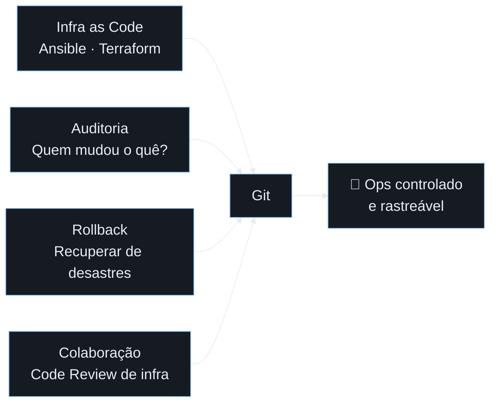
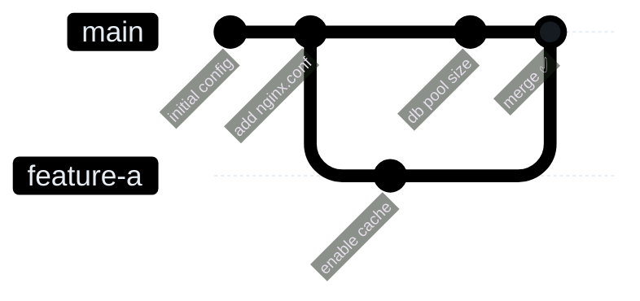
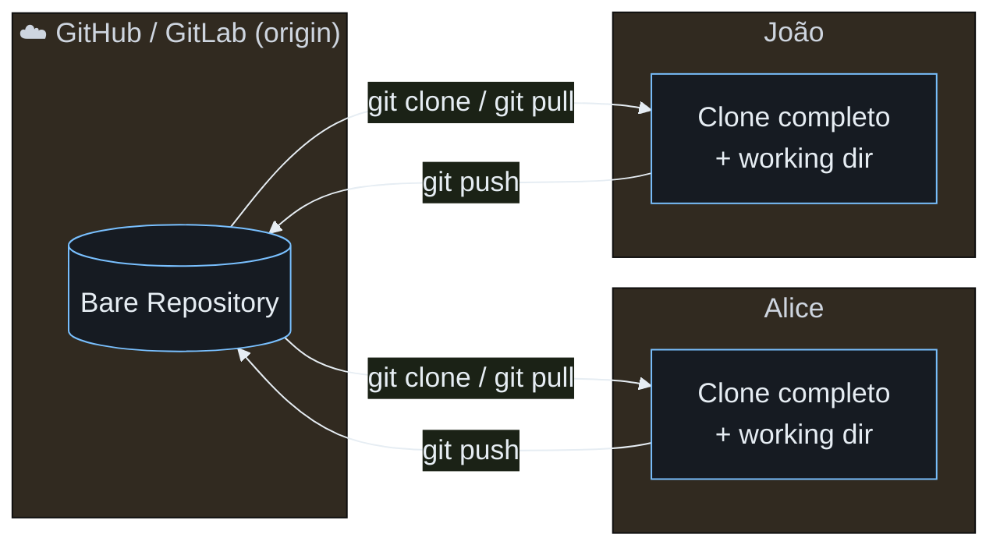
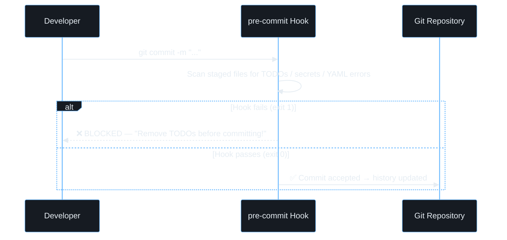
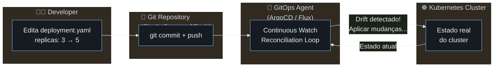

# Git for DevOps & Ops
## From System Administration to GitOps

> _"An Ops team without Git is like a surgeon without a scalpel."_

**~90 min** · 8 módulos · hands-on a cada módulo

---

## Agenda

| Módulo | Tema | Duração |
|--------|------|---------|
| **01** | Introdução — Porquê Git para Ops? | 5 min |
| **02** | Configuração Inicial | 5 min |
| **03** | Workflow Básico (os 3 estados) | 15 min |
| **04** | Branching & Merging | 25 min |
| **05** | Colaboração & Remotes | 10 min |
| **06** | Power Tools para Ops | 15 min |
| **07** | Git Hooks (automação local) | 10 min |
| **08** | Introdução ao GitOps | 5 min |

---

## Module 01: Introdução (5 min)
### Porquê Git para Ops?



> 🎯 **Focar aqui:** Perguntar à sala — "Quem já perdeu uma config de prod sem saber quem mudou?"

---

### Git vs. Sistemas Antigos

| | **SVN / CVS** | **Git** |
|-|---|---|
| Arquitetura | Centralizado (servidor único) | Distribuído (cópia completa local) |
| Histórico | Requer ligação ao servidor | 100% local, alta velocidade |
| Branching | Lento, caro (cópia de diretórios) | Instantâneo (apenas ponteiros) |
| Offline | Não funciona | Funciona completamente |
| Recuperação | Se o servidor cai, para tudo | Cada clone é um backup completo |

> ⚡ **Demo:** `./run-exercises.sh 01` — verificar versão e fazer `git init`

---

## Module 02: Configuração Inicial (5 min)
### O mínimo indispensável

```bash
# Identidade — aparece em todos os commits
git config --global user.name "João Cortes"
git config --global user.email "joao@empresa.com"

# Editor padrão (VS Code, nano, vim...)
git config --global core.editor "code --wait"

# Branch padrão (boa prática moderna)
git config --global init.defaultBranch main
```

---

### Aliases que salvam tempo em Ops

```bash
# Log visual — o mais útil do dia-a-dia
git config --global alias.lg \
  "log --oneline --graph --all --decorate"

# Status compacto
git config --global alias.st status

# Ver o último commit
git config --global alias.last "log -1 HEAD"
```

> 🎯 **Focar aqui:** O alias `git lg` vai aparecer em todos os módulos seguintes.
> Mostrar o resultado de `git lg` num repo com histórico rico.

---

## Module 03: Workflow Básico (15 min)
### Os 3 Estados — o coração do Git

```
╔══════════════╗    git add     ╔══════════════╗   git commit  ╔══════════════╗
║   Working    ║ ─────────────► ║   Staging    ║ ────────────► ║  Repository  ║
║  Directory   ║                ║     Area     ║               ║   (.git/)    ║
║              ║ ◄────────────  ║              ║               ║              ║
║  (modified)  ║  git restore   ║   (staged)   ║               ║ (committed)  ║
╚══════════════╝                ╚══════════════╝               ╚══════════════╝
      💻                              📦                             🗄️
  Ficheiros no                  "Carrinho de                  Snapshot imutável
  disco local                   compras"                      com hash SHA
```

> 🎯 **Focar aqui:** A analogia do "carrinho de compras" — faz staging de _apenas_ o que queres no próximo commit.

---

### Comandos do Ciclo Básico

```bash
git status          # Ver o estado atual (RED = untracked/modified, GREEN = staged)
git add config.yml  # Mover para Staging Area
git add .           # Staging de todos os ficheiros modificados
git diff            # Ver o que mudou (Working vs Staged)
git diff --cached   # Ver o que está staged (Staged vs Last commit)
git commit -m "feat: add database config"   # Snapshot permanente
git log --oneline   # Ver histórico resumido
git lg              # Ver histórico visual (alias configurado no módulo 02)
```

> ⚡ **Demo:** `./run-exercises.sh 03` — criar `config.yml`, stage, commit, `git diff`

---

### ⚠️ O Perigo Permanente dos Secrets

```
Git vs SVN — O problema é PIOR no Git:

  Em SVN:   Password no servidor central → reconstrução complexa do servidor
            (afeta apenas o servidor)

  Em Git:   Password no commit → cada 'git pull' distribui o secret
            para TODOS os developers! 🌍
            
  Regra de ouro: O que entra no histórico, fica PARA SEMPRE.
  Mesmo apagando no commit seguinte, está visível em git log!
```

> **Solução:** HashiCorp Vault · Kubernetes Secrets · `.env` no `.gitignore` · Git Hooks (Módulo 07)

---

## Module 04: Branching & Merging (25 min)
### O que é um Branch?



> 🎯 **Focar aqui:** Um branch é apenas um _ponteiro_ para um commit. Criar um branch custa literalmente 41 bytes!

---

### GitHub Flow vs GitFlow

| | **GitHub Flow** | **GitFlow** |
|-|---|---|
| Complexidade | Simples (2 tipos de branch) | Complexa (5 tipos) |
| Ideal para | Deploy contínuo, SaaS | Versões com release schedule |
| Branches | `main` + `feature/*` | `main`, `develop`, `feature`, `release`, `hotfix` |
| Ops / DevOps | ✅ Recomendado | ⚠️ Apenas se precisares de versioning |

> **Para Ops:** GitHub Flow é o suficiente na grande maioria dos casos.

---

### Comandos de Branching

```bash
git checkout -b feature-a    # Criar e mudar para novo branch
git branch                   # Listar branches locais
git checkout main            # Mudar de volta para main
git merge feature-a          # Fazer merge do feature-a no branch atual
git branch -d feature-a      # Apagar branch após merge
git lg                       # Ver o grafo visual dos branches
```

---

### Anatomia de um Conflito

```
<<<<<<< HEAD              ← O que ESTÁ no teu branch atual (main)
DB_POOL_SIZE=20
=======                   ← Separador
CACHE_ENABLED=true
>>>>>>> feature-a         ← O que VEIO do branch que estás a fazer merge
```

**Para resolver:**
1. Apagar as 3 linhas de marcadores (`<<<<<<<`, `=======`, `>>>>>>>`)
2. Ficar com o conteúdo que queres (um, outro, ou ambos)
3. `git add config.env` → `git commit -m "merge: resolve conflict"`

> ⚡ **Demo:** `./run-exercises.sh 04` — conflito real em `config.env`, resolução manual

---

## Module 05: Colaboração & Remotes (10 min)
### Git é Distribuído



> 🎯 **Focar aqui:** `origin` é apenas um _nickname_ — podes ter múltiplos remotes (fork + upstream).

---

### Comandos de Colaboração

```bash
git clone <url>           # Clonar repositório remoto (cria 'origin' automaticamente)
git remote -v             # Ver todos os remotes configurados
git fetch origin          # Descarregar updates SEM modificar o working dir
git pull origin main      # fetch + merge (atualizar branch local)
git push origin main      # Enviar commits locais para o servidor
git push -u origin main   # Primeiro push (define o upstream)
```

```
                    ┌─ git fetch ─► origin/main (referência local)
git pull = ─────────┤
                    └─ git merge origin/main ─► main (teu branch)
```

> ⚡ **Demo:** `./run-exercises.sh 05` — clone, push, simular colega (Alice), `git pull`

---

### Pull Requests — A Base do Code Review

```
  Developer              Reviewer / Tech Lead
      │                         │
      ├─ git push origin ──────►│
      │   feature/my-change     │
      │                         ├─ Revê o diff
      │                         ├─ Comenta
      │◄────────── Aprova ──────┤
      │                         │
      ├─ Merge para main ──────►│
      │                         │
```

> **Ops Best Practice:** Nenhuma mudança em infra vai para `main` sem pelo menos 1 aprovação.

---

## Module 06: Ops Power Tools (15 min)
### Ferramentas que salvam o dia

---

### `git stash` — O Botão de Pausa

**Cenário:** Estás a migrar o nginx para HTTPS. Chega alerta crítico de prod. Precisas de mudar de branch _agora_.

```bash
git stash              # Guarda trabalho inacabado na "pilha" (stack)
git stash list         # Ver o que está no stash
git stash show -p      # Ver o diff completo do que está guardado
# ... resolve o problema de prod em outro branch ...
git stash pop          # Recupera o teu trabalho — continuas de onde ficaste!
```

```
Stash Stack:
  stash@{0} → WIP: migrar nginx para HTTPS  ← pop recupera este
  stash@{1} → WIP: update ansible playbook
```

> ⚡ **Demo:** `./run-exercises.sh 06` — stash de `nginx.conf` com SSL inacabado

---

### `git cherry-pick` — Cirurgia de Commits

**Cenário:** Branch `experimental` tem um hotfix crítico (bloquear IP malicioso). Precisas _apenas_ desse commit em `main`, sem o resto do experimental.

```bash
# 1. Encontrar o hash do commit que queres
git log experimental --oneline -n 5
# abc1234 fix: block malicious IP on firewall
# def5678 wip: experimental feature (não queres este!)

# 2. Aplicar cirurgicamente apenas esse commit em main
git checkout main
git cherry-pick abc1234
```

> 🎯 **Focar aqui:** `cherry-pick` copia o commit criando um **novo** SHA — não é o mesmo commit.

---

### `git rebase` ⚠️ e `git reset` ⚠️

| Comando | O que faz | Quando usar | Risco |
|---------|-----------|-------------|-------|
| `git rebase` | Reescreve histórico (aplica commits em cima de outra base) | Limpar histórico antes de PR | Alto — nunca em branches partilhados |
| `git reset --soft` | Desfaz commit, mantém staging | Corrigir mensagem do último commit | Baixo |
| `git reset --hard` | Desfaz commit E descarta mudanças | Abortar um caminho errado | Alto — perde trabalho! |

> ⚠️ Regra de ouro: **Nunca reescreves histórico que já foi partilhado com outros.**

---

## Module 07: Git Hooks (10 min)
### Automação Local — O teu guardião silencioso



---

### Hooks mais úteis para Ops

| Hook | Quando dispara | Uso típico em Ops |
|------|---------------|-------------------|
| `pre-commit` | Antes de criar o commit | Validar YAML/JSON, bloquear secrets, TODO scan |
| `commit-msg` | Após escrever a mensagem | Forçar Conventional Commits (`feat:`, `fix:`) |
| `pre-push` | Antes de `git push` | Correr testes, validar ansible-lint |
| `post-merge` | Após `git pull/merge` | Instalar dependências automaticamente |

```bash
# Localização dos hooks
ls .git/hooks/         # Templates com .sample (inativos)
chmod +x .git/hooks/pre-commit   # Ativar — deve ser executável!
```

---

### Exemplo Real: Bloquear TODOs e Secrets

```bash
#!/bin/sh
# .git/hooks/pre-commit

# Bloquear ficheiros com TODO inacabado
if grep -q "TODO" $(git diff --cached --name-only); then
    echo "❌ ERROR: Remove TODOs before committing!"
    exit 1
fi

# Bloquear possíveis passwords/API keys (padrão simples)
if git diff --cached | grep -qiE "(password|api_key|secret)\s*=\s*\S+"; then
    echo "❌ ERROR: Possible secret detected! Use Vault or env vars."
    exit 1
fi
```

> 🎯 **Focar aqui:** Ferramenta recomendada para equipas — [`pre-commit`](https://pre-commit.com) (gere hooks como código, versionados no repo)

> ⚡ **Demo:** `./run-exercises.sh 07` — criar hook, testar bloqueio, corrigir e commit com sucesso

---

## Module 08: Introdução ao GitOps (5 min)
### A Evolução Natural do DevOps



---

### O Loop de Reconciliação GitOps

```
  Git (Desired State)          Cluster (Real State)
  ────────────────────         ────────────────────
  deployment.yaml              5 pods running
  replicas: 5          ══════► 3 pods running  ← DRIFT!
                               
  [GitOps Agent] ⚡ Drift detected!
  [GitOps Agent] 🔄 Reconciling...
  [GitOps Agent] ✅ 2 pods added → 5 pods running → IN SYNC
```

> 🎯 **Regra crítica:** Nunca modificas o cluster diretamente! Toda a mudança passa pelo Git.

---

### GitOps vs. Ops Tradicional

| | **Ops Tradicional** | **GitOps** |
|-|---|---|
| Como mudar prod | `kubectl apply` direto | Commit em Git → agente aplica |
| Auditoria | Logs dispersos, incompletos | `git log` — quem, o quê, quando, porquê |
| Rollback | Manual, arriscado | `git revert` → cluster reverte automaticamente |
| Colaboração | SSH + acesso direto ao cluster | Pull Request com review obrigatório |
| Drift | Silencioso e perigoso | Detetado e corrigido automaticamente |

---

### Ferramentas do Ecossistema GitOps

```
  ┌─────────────────────────────────────────────────┐
  │               GitOps Ecosystem                  │
  ├─────────────────────────────────────────────────┤
  │  ArgoCD     → UI rica, multi-cluster, RBAC      │
  │  Flux CD    → Lightweight, cloud-native, CLI    │
  │  GitLab CI  → Integrado no mesmo repo           │
  │  Helm       → Packaging de aplicações K8s       │
  │  Kustomize  → Overlays por environment (base/   │
  │               staging / prod)                   │
  └─────────────────────────────────────────────────┘
```

> ⚡ **Demo:** `./run-exercises.sh 08` — declarar estado em YAML, simular loop ArgoCD, escalar via Git

---

## Resumo — O que Aprendemos Hoje

```
  ┌─────────────────────────────────────────────────┐
  │  Git for Ops — Cheat Sheet                      │
  ├─────────────────────────────────────────────────┤
  │  git init / clone     → Começar / copiar repo   │
  │  git add / commit     → Snapshot de mudanças    │
  │  git log --oneline    → Ver histórico           │
  │  git branch / merge   → Trabalho paralelo       │
  │  git stash / pop      → Pausar e retomar        │
  │  git cherry-pick      → Copiar commit específico│
  │  git push / pull      → Sincronizar com equipa  │
  │  .git/hooks/          → Automação local         │
  └─────────────────────────────────────────────────┘
```

---

### Key Takeaways

- **Histórico imutável** → Auditoria completa de quem mudou o quê
- **Branching grátis** → Isola risco, facilita review
- **Distribuído** → Cada clone é um backup; funciona offline
- **Hooks** → Primeira linha de defesa contra secrets e erros
- **GitOps** → Git como source of truth para infra e deployments

> **Próximos passos:** ArgoCD em cluster real · Ansible integrado com Git · Pipeline CI/CD completo

---

# Vamos trabalhar!

```bash
./run-exercises.sh 01   # Introdução
./run-exercises.sh 02   # Configuração
./run-exercises.sh 03   # Workflow básico
./run-exercises.sh 04   # Branching & Merging
./run-exercises.sh 05   # Remotes
./run-exercises.sh 06   # Power Tools
./run-exercises.sh 07   # Git Hooks
./run-exercises.sh 08   # GitOps
```

Cada módulo tem **README.md** com os objetivos e o script de exercícios guiados.
