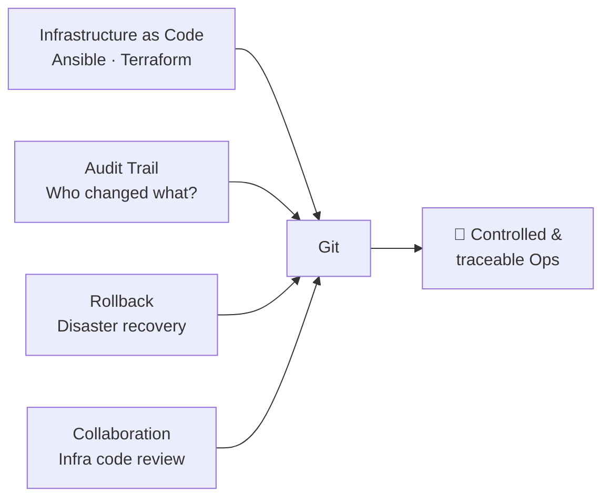
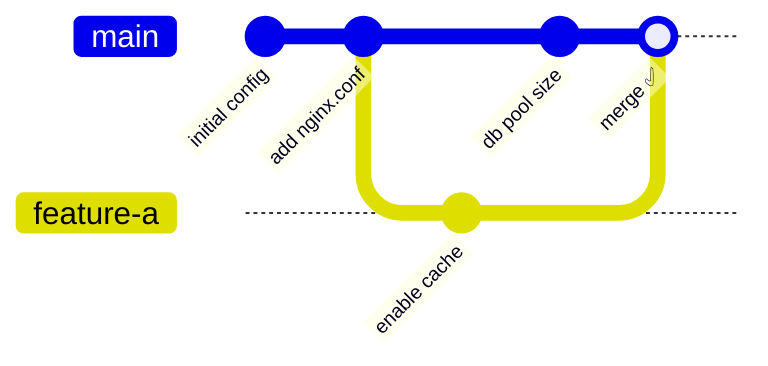
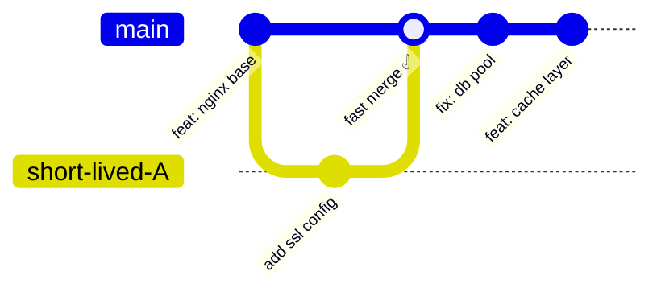
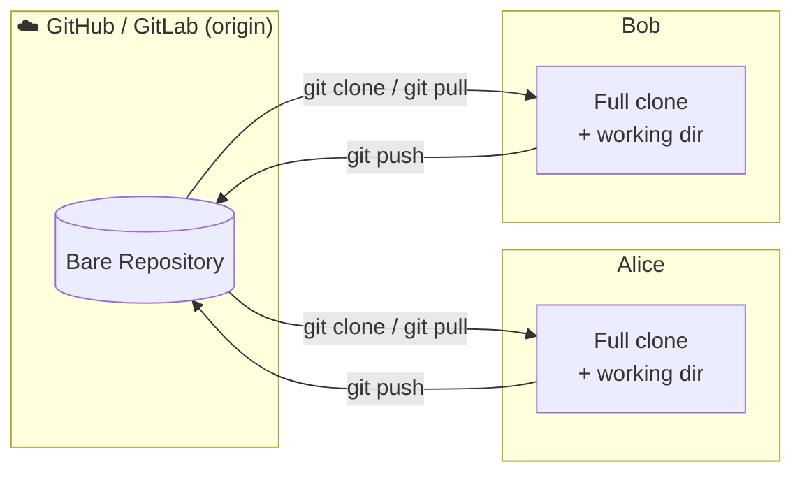
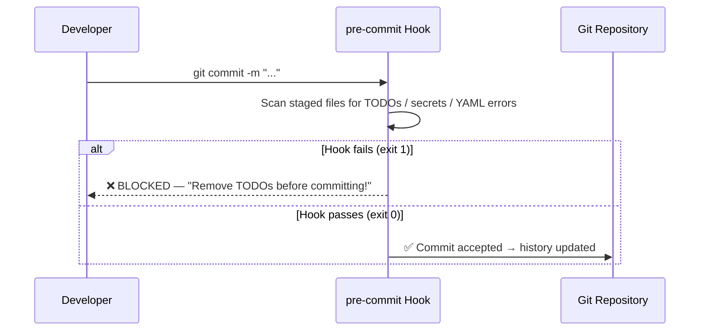
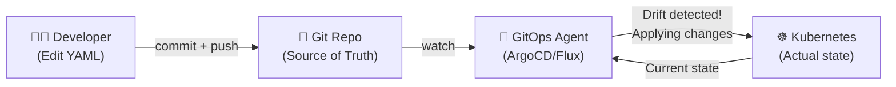

# Git for Ops
## From System Administration to GitOps

> _"An Ops team without Git is like a surgeon without a scalpel."_

**~90 min** · 8 modules · hands-on after each module

---

## Agenda

| Module | Topic | Duration |
|--------|-------|----------|
| **01** | Introduction — Why Git for Ops? | 5 min |
| **02** | Initial Configuration | 5 min |
| **03** | Basic Workflow (the 3 states) | 15 min |
| **04** | Branching & Merging | 25 min |
| **05** | Collaboration & Remotes | 10 min |
| **06** | Power Tools for Ops | 15 min |
| **07** | Git Hooks (local automation) | 10 min |
| **08** | Introduction to GitOps | 5 min |

---

## Module 01: Introduction (5 min)
### The Origins of Git

- **The Problem:** Linus Torvalds (creator of Linux) was managing the kernel source code. He was deeply disappointed with the proprietary tools available at the time.
- **The Solution:** In 2005, he took 10 days to write the first version of his own tool: Git.
- **The Philosophy:** It had to be insanely fast, fully distributed, and capable of handling massive projects without relying on a slow central server.

---

### Myths and Truths about Git

- ❌ **Myth:** "I need a GitHub account to use Git."
  ✅ **Truth:** Git works entirely locally. You don't need the internet or an account to use version control on your machine.
- ❌ **Myth:** "Git requires a remote server to collaborate."
  ✅ **Truth:** John can share his repository directly with Jane over a local network. We only use remote servers (like GitHub) for **convenience** — if John goes on vacation, we don't want his laptop to stay powered on just so others can access the code!
- ❌ **Myth:** "Git is only for software developers."
  ✅ **Truth:** Git tracks *any* text. Ops teams use it for Ansible, Terraform, and documentation.

---

### Why Git for Ops?



> 🎯 **Focus here:** Ask the room — _"Who has ever lost a prod config with no idea who changed it?"_

---

### Git vs. Legacy Systems

| | **SVN / CVS** | **Git** |
|-|---|---|
| Architecture | Centralised (single server) | Distributed (full local copy) |
| History | Requires server connection | 100% local, high speed |
| Branching | Slow, expensive (directory copies) | Instant (just pointers) |
| Offline | Does not work | Fully functional |
| Recovery | If server goes down, everything stops | Every clone is a full backup |

> ⚡ **Demo:** `./run-exercises.sh 01` — check version and run `git init`

---

## Module 02: Initial Configuration (5 min)
### The bare minimum to get started

```bash
# Identity — appears in every commit
git config --global user.name "Your Name"
git config --global user.email "you@company.com"

# Default editor (VS Code, nano, vim...)
git config --global core.editor "code --wait"

# Default branch name (modern best practice)
git config --global init.defaultBranch main
```

---

### Time-saving Aliases for Ops

```bash
# Visual log — the most useful alias day-to-day
git config --global alias.lg \
  "log --oneline --graph --all --decorate"

# Compact status
git config --global alias.st status

# Show last commit
git config --global alias.last "log -1 HEAD"
```

> 🎯 **Focus here:** The `git lg` alias will appear in every module from now on.
> Show the output of `git lg` on a repo with rich history.

> ⚡ **Demo:** `./run-exercises.sh 02` — configure identity and aliases

---

## Module 03: Basic Workflow (15 min)
### The 3 States — the heart of Git

```
╔══════════════╗    git add     ╔══════════════╗   git commit  ╔══════════════╗
║   Working    ║ ─────────────► ║   Staging    ║ ────────────► ║  Repository  ║
║  Directory   ║                ║     Area     ║               ║   (.git/)    ║
║              ║ ◄────────────  ║              ║               ║              ║
║  (modified)  ║  git restore   ║   (staged)   ║               ║ (committed)  ║
╚══════════════╝                ╚══════════════╝               ╚══════════════╝
      💻                              📦                             🗄️
  Local files                   "Shopping cart"              Immutable snapshot
  on disk                       for next commit              with SHA hash
```

> 🎯 **Focus here:** The "shopping cart" analogy — you stage _only_ what you want in the next commit.

---

### Basic Cycle Commands

```bash
git status          # Check current state (RED = untracked/modified, GREEN = staged)
git add config.yml  # Move file to Staging Area
git add .           # Stage all modified files
git diff            # See what changed (Working vs Staged)
git diff --cached   # See what is staged (Staged vs Last commit)
git commit -m "feat: add database config"   # Permanent snapshot
git log --oneline   # View concise history
git lg              # Visual history graph (alias set up in module 02)
```

> ⚡ **Demo:** `./run-exercises.sh 03` — create `config.yml`, stage, commit, `git diff`

---

### ⚠️ The Permanent Danger of Secrets

```
Git vs SVN — the problem is WORSE in Git:

  In SVN:   Password on the central server → complex server rebuild
            (affects only the server)

  In Git:   Password in a commit → every 'git pull' distributes the secret
            to ALL developers! 🌍

  Golden rule: What enters history stays FOREVER.
  Even if you delete it in the next commit, it is still visible in git log!
```

> **Solution:** HashiCorp Vault · Kubernetes Secrets · `.env` in `.gitignore` · Git Hooks (Module 07)

---

### ⚠️ The Danger of Altering History

**The Shared Calendar Analogy:** Imagine you and a colleague use a shared digital calendar.

- **The Commitment (Push):** Monday, you schedule *"Friday 1pm: Pizza"*. Your colleague syncs their calendar (`git pull`) and blocks their Friday.
- **Altering the Past (Force Push):** Wednesday, you secretly alter the original event to *"Thursday 1pm: Sushi"*.
- **The Clash (Conflict):** Your colleague didn't sync again. Friday at 1pm, they arrive at the Pizzeria. You tell them: *"Lunch was yesterday!"*

**The Result in Git:**
- Your colleague wasted time (valid work thrown away).
- Their local repository is now in massive conflict with yours.

**Golden Rule:** Never alter history on a branch that others are using!

> 💡 **"Rewriting history is like secretly changing plans retroactively. Your colleagues' code will arrive at the 'wrong restaurant' creating a massive conflict."**

---

## Module 04: Branching & Merging (25 min)
### What is a Branch?



> 🎯 **Focus here:** A branch is just a _pointer_ to a commit. Creating a branch literally costs 41 bytes!

---

### Branching Strategies — Which one to pick?

| | **GitFlow** | **GitHub Flow** | **Trunk Based Dev** |
|-|---|---|---|
| Complexity | High (5 branch types) | Medium (2 types) | Low (1 branch) |
| Branch lifetime | Weeks / months | Days / weeks | Hours (max 1–2 days) |
| Best for | Versioned releases | Continuous deploy | CI/CD + GitOps |
| Requires | Discipline + tooling | PR culture | Feature flags + CI |
| Ops | ⚠️ Avoid | ✅ Good | ✅✅ **Recommended** |

> 🎯 **Focus here:** The longer a branch lives, the more painful the merge. TBD eliminates that pain.

> 💬 **Presenter note:** This table is intentionally opinionated. Branching strategies are a hotly debated topic in the industry — there is no universal answer, and teams often adapt each model to their context. This could easily fill a dedicated session on its own. If the discussion opens up, acknowledge the debate and move on — the goal here is awareness, not consensus.

---

### Trunk Based Development (TBD)



- Everyone integrates into `main` **at least once a day**
- Short-lived branches: **hours, never days**
- Unfinished features hidden with **feature flags**, not long branches
- Requires a **strong CI pipeline** to catch regressions fast

> 🎯 **Focus here:** TBD is the natural companion to GitOps — `main` is always deployable.

---

### TBD — Feature Flags in Practice

```yaml
# ansible/vars/features.yml — the feature flag file, also in Git!
features:
  new_tls_config: false    # commit the code, hide the behaviour
  rate_limiting: true
  experimental_cache: false
```

```bash
# Your playbook only activates the feature when the flag is true
- name: Apply new TLS config
  include_tasks: tls_v2.yml
  when: 
    - features.new_tls_config
```

**TBD workflow:**
1. Commit code behind a flag → `main` stays green
2. Enable flag in staging → validate
3. Enable flag in prod → instant rollback = flip flag to `false`

> ⚠️ **No flag = no merge to main** if the feature is not yet ready for prod.

---

### Branching Commands

```bash
git checkout -b feature-a    # Create and switch to a new branch
git branch                   # List local branches
git checkout main            # Switch back to main
git merge feature-a          # Merge feature-a into the current branch
git branch -d feature-a      # Delete branch after merge
git lg                       # View visual branch graph
```

---

### Anatomy of a Conflict

```
<<<<<<< HEAD              ← What IS in your current branch (main)
DB_POOL_SIZE=20
=======                   ← Separator
CACHE_ENABLED=true
>>>>>>> feature-a         ← What CAME from the branch you are merging in
```

**To resolve:**
1. Delete the 3 marker lines (`<<<<<<<`, `=======`, `>>>>>>>`)
2. Keep the content you want (one side, the other, or both)
3. `git add config.env` → `git commit -m "merge: resolve conflict"`

> ⚡ **Demo:** `./run-exercises.sh 04` — real conflict in `config.env`, manual resolution

---

## Module 05: Collaboration & Remotes (10 min)
### Git is Distributed



> 🎯 **Focus here:** `origin` is just a _nickname_ — you can have multiple remotes (fork + upstream).

> 💬 **Presenter note:** `upstream` will be explained in the next slide — it has two different meanings in Git and is worth clarifying.

---

### Collaboration Commands

```bash
git clone <url>           # Clone remote repository (creates 'origin' automatically)
git remote -v             # View all configured remotes
git fetch origin          # Download updates WITHOUT modifying the working dir
git pull origin main      # fetch + merge (update local branch)
git push origin main      # Send local commits to the server
git push -u origin main   # First push (sets the upstream tracking)
```

```
                    ┌─ git fetch ─► origin/main (local reference)
git pull = ─────────┤
                    └─ git merge origin/main ─► main (your branch)
```

> ⚡ **Demo:** `./run-exercises.sh 05` — clone, push, simulate colleague (Alice), `git pull`

---

### Understanding "upstream" — Two meanings

**Meaning 1 — Tracking branch** (local Git concept)

```bash
# -u sets which remote branch your local branch "follows"
git push -u origin main

# After this, Git knows the link:
#   local branch:  main
#   tracks:        origin/main   ← this is the "upstream"

# Now these shortcuts work without specifying remote + branch:
git push        # knows to push to origin/main
git pull        # knows to pull from origin/main
git status      # shows "Your branch is ahead of 'origin/main' by 2 commits"
```

**Meaning 2 — The original repo** (open-source / fork workflow)

```bash
# You fork a project on GitHub → your fork is 'origin'
# The original project repo is called 'upstream' by convention
git remote add upstream https://github.com/original-org/project.git

git remote -v
# origin    https://github.com/YOU/project.git   (push/pull your fork)
# upstream  https://github.com/original-org/project.git  (pull updates from source)

# Sync your fork with the original project:
git fetch upstream
git merge upstream/main
```

> 🎯 **Focus here:** In day-to-day Ops work, "upstream" almost always means **Meaning 1** — the remote branch your local branch tracks.

---

### Pull Requests — The Foundation of Code Review

```
  Developer              Reviewer / Tech Lead
      │                         │
      ├─ git push origin ──────►│
      │   feature/my-change     │
      │                         ├─ Reviews the diff
      │                         ├─ Leaves comments
      │◄────────── Approves ────┤
      │                         │
      ├─ Merge to main ────────►│
      │                         │
```

**Example PR Description:**
- **Title:** `feat: enable rate limiting on frontend`
- **Why:** Prevent abuse from bad bots on `/login`
- **What:** Applied limit of 10 req/s per IP
- **Rollback:** Revert this PR or set `rate_limiting: false`

> **Ops Best Practice:** No infrastructure change goes to `main` without at least 1 approval.

---

## Module 06: Ops Power Tools (15 min)
### Tools that save the day

---

### `git stash` — The Pause Button

**Scenario:** You are migrating nginx to HTTPS. A critical prod alert comes in. You need to switch branches _right now_.

```bash
git stash              # Save unfinished work onto the stack
git stash list         # See what is in the stash
git stash show -p      # See the full diff of what is stored
# ... fix the prod issue on another branch ...
git stash pop          # Recover your work — continue right where you left off!
```

```
Stash Stack:
  stash@{0} → WIP: migrate nginx to HTTPS   ← pop recovers this
  stash@{1} → WIP: update ansible playbook
```

> ⚡ **Demo:** `./run-exercises.sh 06` — stash `nginx.conf` with unfinished SSL config

---

### `git cherry-pick` — Commit Surgery

**Scenario:** The `experimental` branch has a critical hotfix (block a malicious IP). You need _only_ that commit on `main`, without the rest of the experimental work.

```bash
# 1. Find the hash of the commit you want
git log experimental --oneline -n 5
# abc1234 fix: block malicious IP on firewall
# def5678 wip: experimental feature (you do NOT want this!)

# 2. Surgically apply only that commit onto main
git checkout main
git cherry-pick abc1234
```

> 🎯 **Focus here:** `cherry-pick` copies the commit creating a **new** SHA — it is not the same commit object.

---

### `git reset` — Undoing local mistakes

**`git reset --soft`** — safest: moves HEAD back, keeps your changes staged
**Scenario:** You committed too early with a bad message, or forgot to add a file. It's only local, not pushed yet.

```bash
git log --oneline
# a1b2c3 WIP asdfasdf       ← this commit is a mess
# d4e5f6 feat: add nginx config

git reset --soft HEAD~1    # undo last commit, keep changes staged
git commit -m "feat: add ssl termination to nginx"   # clean re-commit
```

**`git reset --hard`** — destructive: moves HEAD back AND discards all changes
**Scenario:** You went down the wrong path experimenting and want to start over entirely from a known good state.

```bash
git reset --hard HEAD~2    # wipe last 2 commits + working dir changes
# ⚠️ No recovery without git reflog — only use locally, never after push
```

> ⚠️ Golden rule: **Never reset commits that have already been pushed / shared with others.**

> ⚡ **Demo:** `./run-exercises.sh 06` — undo a mistake with `reset --soft` and `reset --hard`

---

### `git rebase` — Replaying commits on a new base

**Scenario:** You've been working on a feature branch for a few days. Meanwhile, `main` has moved forward with critical updates. You want to bring those updates into your branch, but keep a clean, linear history for your final PR.

```
BEFORE rebase:                    AFTER git rebase main:

  main:     A─B─C                   main:     A─B─C
                 \                                  \
  feature:        D─E                feature:        D'─E'
                                                 (new SHA!)
```

`rebase` picks up your branch commits (D, E) and **replays** them on top of the latest `main`.
The result is a clean, linear history — no merge commit noise.

```bash
git checkout feature/my-fix
git rebase main          # replay my commits on top of latest main

# If conflicts appear during rebase:
git status               # see which files conflict
# ... resolve conflicts manually ...
git add resolved-file.yml
git rebase --continue    # move to next commit
# or: git rebase --abort  # give up and go back to before rebase
```

> 🎯 **Focus here:** `rebase` rewrites SHAs — safe only on **your own local branch**, never on shared branches.
> ⚠️ If in doubt: use `git merge` instead. Less clean history, but zero risk of breaking teammates.

> ⚡ **Demo:** `./run-exercises.sh 06` — rebase a feature branch onto main

---

## Module 07: Git Hooks (10 min)
### Local Automation — Your silent guardian



---

### Most Useful Hooks for Ops

| Hook | When it fires | Typical Ops use |
|------|--------------|-----------------|
| `pre-commit` | Before creating the commit | Validate YAML/JSON, block secrets, TODO scan |
| `commit-msg` | After writing the message | Enforce Conventional Commits (`feat:`, `fix:`) |
| `pre-push` | Before `git push` | Run tests, validate ansible-lint |
| `post-merge` | After `git pull/merge` | Automatically install dependencies |

```bash
# Hooks location
ls .git/hooks/         # Templates ending in .sample (inactive by default)
chmod +x .git/hooks/pre-commit   # Activate — must be executable!
```

---

### Real Example: Block TODOs and Secrets

```bash
#!/bin/sh
# .git/hooks/pre-commit

# Block files with unfinished TODOs
if grep -q "TODO" $(git diff --cached --name-only); then
    echo "❌ ERROR: Remove TODOs before committing!"
    exit 1
fi

# Block possible passwords / API keys (simple pattern)
if git diff --cached | grep -qiE "(password|api_key|secret)\s*=\s*\S+"; then
    echo "❌ ERROR: Possible secret detected! Use Vault or env vars."
    exit 1
fi
```

> 🎯 **Focus here:** Recommended team tool — [`pre-commit`](https://pre-commit.com) (manages hooks as code, versioned in the repo)

> ⚡ **Demo:** `./run-exercises.sh 07` — create hook, test blocking, fix and commit successfully

---

## Module 08: Introduction to GitOps (5 min)
### The Natural Evolution of Ops



---

### The GitOps Reconciliation Loop

```
  Git (Desired State)          Cluster (Real State)
  ────────────────────         ────────────────────
  deployment.yaml              5 pods running
  replicas: 5          ══════► 3 pods running  ← DRIFT!

  [GitOps Agent] ⚡ Drift detected!
  [GitOps Agent] 🔄 Reconciling...
  [GitOps Agent] ✅ 2 pods added → 5 pods running → IN SYNC
```

> 🎯 **Critical rule:** You never modify the cluster directly! Every change goes through Git.

---

### GitOps vs. Traditional Ops

| | **Traditional Ops** | **GitOps** |
|-|---|---|
| How to change prod | `kubectl apply` directly | Commit to Git → agent applies |
| Audit trail | Scattered, incomplete logs | `git log` — who, what, when, why |
| Rollback | Manual, risky | `git revert` → cluster auto-reverts |
| Collaboration | SSH + direct cluster access | Pull Request with mandatory review |
| Drift | Silent and dangerous | Detected and auto-corrected |

---

### GitOps Ecosystem Tools

```
  ┌─────────────────────────────────────────────────┐
  │               GitOps Ecosystem                  │
  ├─────────────────────────────────────────────────┤
  │  ArgoCD     → Rich UI, multi-cluster, RBAC      │
  │  Flux CD    → Lightweight, cloud-native, CLI    │
  │  GitLab CI  → Integrated in the same repo       │
  │  Helm       → K8s application packaging         │
  │  Kustomize  → Environment overlays (base /      │
  │               staging / prod)                   │
  └─────────────────────────────────────────────────┘
```

> ⚡ **Demo:** `./run-exercises.sh 08` — declare state in YAML, simulate ArgoCD loop, scale via Git

---

## Summary — What We Learned Today

```
  ┌─────────────────────────────────────────────────┐
  │  Git for Ops — Cheat Sheet                      │
  ├─────────────────────────────────────────────────┤
  │  git init / clone     → Start / copy a repo     │
  │  git add / commit     → Snapshot changes        │
  │  git log --oneline    → View history            │
  │  git branch / merge   → Parallel work           │
  │  git stash / pop      → Pause and resume        │
  │  git cherry-pick      → Copy a specific commit  │
  │  git push / pull      → Sync with the team      │
  │  .git/hooks/          → Local automation        │
  └─────────────────────────────────────────────────┘
```

---

### Key Takeaways

- **Immutable history** → Full audit trail of who changed what
- **Free branching** → Isolates risk, enables review
- **Distributed** → Every clone is a backup; works offline
- **Hooks** → First line of defence against secrets and mistakes
- **GitOps** → Git as the single source of truth for infra and deployments

> **Next steps:** ArgoCD on a real cluster · Ansible integrated with Git · Full CI/CD pipeline

---

# Let's get to work!

```bash
./run-exercises.sh 01   # Introduction
./run-exercises.sh 02   # Configuration
./run-exercises.sh 03   # Basic workflow
./run-exercises.sh 04   # Branching & Merging
./run-exercises.sh 05   # Remotes
./run-exercises.sh 06   # Power Tools
./run-exercises.sh 07   # Git Hooks
./run-exercises.sh 08   # GitOps
```

Each module has a **README.md** with objectives and a guided exercise script.
